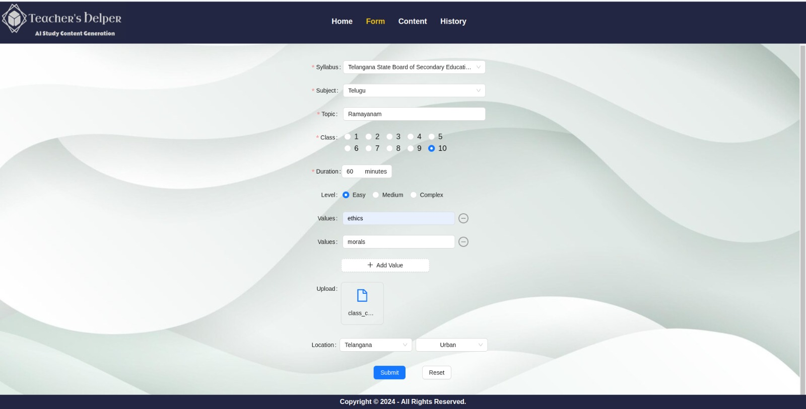
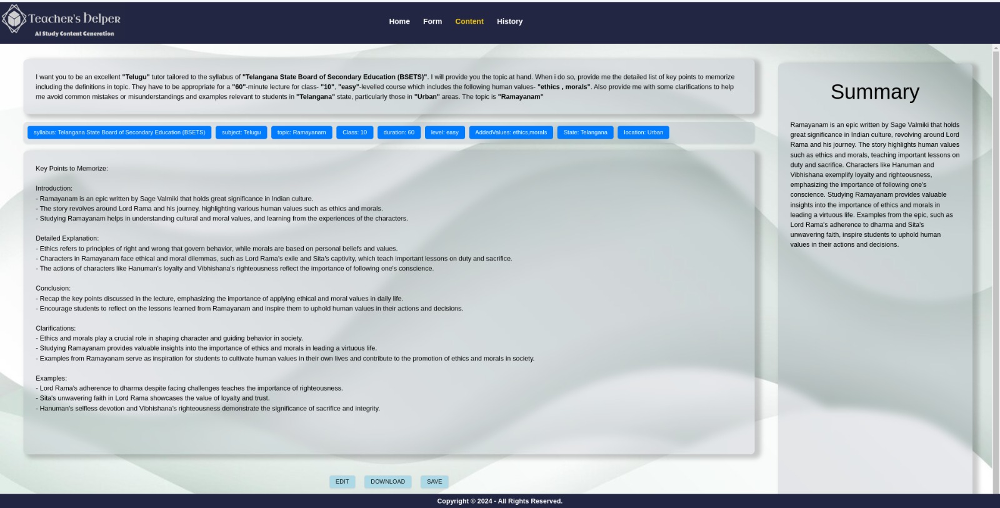
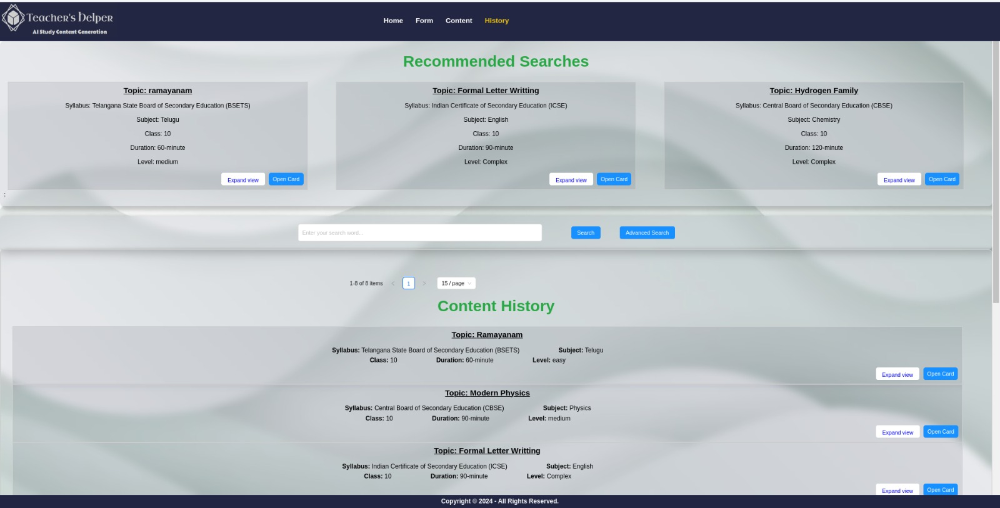

# Instructions for Running

In the terminal, execute the following commands in **different terminals** <br>

**frontend:**<br>
```
cd frontend
npm i
npm i jspdf docx file-saver
npm run dev
```

**backend:**<br>
```
cd backend
pip3 install Flask python-dotenv pymongo openai PyPDF4
python3 flask_server.py
```

# Project Functionality Overview
There are four pages in our Project,
- Home page: The basic instructions of the project.
- Form page: Contains the Form.
- Content page: The generated content for the corresponding filled form.
- History page: The list of all the previously generated contents in the form of cards.

In the form page, upon filling in the required fields and successfully submitting the form; teacher is navigated to the content page, where the content generated is displayed, as per the form submitted. On Saving the generated content, teacher is now navigated to the History page where the latest submitted content can be seen as a card. 

## The Form page
An example form page is,


## Instructions
Teachers are kindly advised to follow the below instructions for getting the best content

 Fields in the form page are:
 - Syllabus - The Educational Boards in India
 - Subject - Subjects offered by the Educational board
 - Topic - Topic the Teacher want to cover in the subject
 - Class - Class or the standard of the students the teacher is explaining to
 - Duration - Duration of the lecture
 - Level - the complexity of the content that should be generated. The options are:
    - Easy
   - Medium
   - Complex
 - Add value - Intended to add Human values into the lecture, if possible.
 - Upload pdf - Can upload **at most One pdf** with size less than or equal to 100KB
 - Location, Region - Used for generating example

**Instructions for obtaining the best possible content:**
- Topic - Enter names of topic without any other information, in a comma-separated manner
- Add value - Add one word values
- Upload pdf - Better to contain exact keywords which describe how teachers want the explanation or subtopics needed


# Content Page
An example content page is,

On submitting the Form in the form page, user is redirected to the content page, where the content is generated according to the entered form.
- Prompt for the form is printed with the user given values; at the top of the page.
- Below the prompt, all the tags are displayed
- The tags are followed by the generated content
- Right side of the page is the summary of the generated content.
- Bottom of the page is options given to the user:
    - **EDIT button** - In the content page, user can edit the generated content.
    - **DOWNLOAD button** - In the content page, user can Download the generated content as a PDF or a DOCX
    - **SAVE button** - Once the user is done with editing, he can SAVE the generated content in the history page by clicking the SAVE button.

Before leaving the content page, if the user does not save the generated content, an alert message is given to save it. However, the user can skip that and the generated content will not be appended to the History page.
Once the SAVE button is clicked, user will be navigated to the History page.

# History Page
An example history page is,

- All the previously generated contents are displayed in the form of cards, with the fields syllabus, subject, topics, etc., as tags on the History page.
- There are three buttons for each card:
 - **Expand View** - Display a summary of the content in the card.
 - **Collapse View** - Condense the card by removing the summary.
 - **Open Card** - Navigate to the Content page to view the entire content of the card.
- The History page also recommends cards related to the recently filled form.
- **Pagination** - The cards are paginated. User has the privilege to choose one of the options: 5, 10, 15, 20, 50 or 100 cards per page.

## Search Functionality
The History page offers two types of searches: Common Search and Advanced Search. Enter the desired fields and click the "Search" button for results.

- **Common Search:** Search for an element across all the tags present in each card.
- **Advanced Search:** Customize your search by selecting specific fields and entering corresponding inputs.
 - On clicking the Advanced Search button, the Common search field will be disabled. To again access the Common search field but loose the entered fields in Advanced Search, refresh the page.

## Accessing History Page
There are two ways to access the History page:

- **Through Content Page:** On submitting a form and clicking on the SAVE button in the content page, the content generated is saved into the History page. The page also recommends cards according to the filled form.
- **Through Form / Home Page:** On navigating to the History page from the Form page or the Home page, the recommending cards are the cards that contain most popular fields in it. A field is said to be popular, if it is present in most of the cards.

# Features
Customization Features:
 - **Refresh** - On reloading or refreshing the page, the progress will be saved.
 - **Search Functionality** - For the fields Syllabus and Subjects, recommendations can be seen as we type in the field.
 - The Subjects list changes according to the select Syllabus or the Board.
 - Summary of the entire content generated is printed in the content page, at the right side.
 - **Upload PDF** - In the content page, we can upload a PDF and it reads the content in the pdf too.
 - **Edit** - Edit the content generated
 - **Download** - Download the generated content as a PDF or DOCX
 - **Common Search** - Search for an element across all the tags present in each card.
 - **Advanced Search** - Customize the search by selecting specific fields and entering corresponding inputs.
 - **Recommended algorithm** - Our website automatically recommends the best 3 cards according to the filled in form by the user.
 - **Pagination** - The cards are paginated. User has the privilege to choose one of the options: 5, 10, 15, 20, 50 or 100 cards per page.
